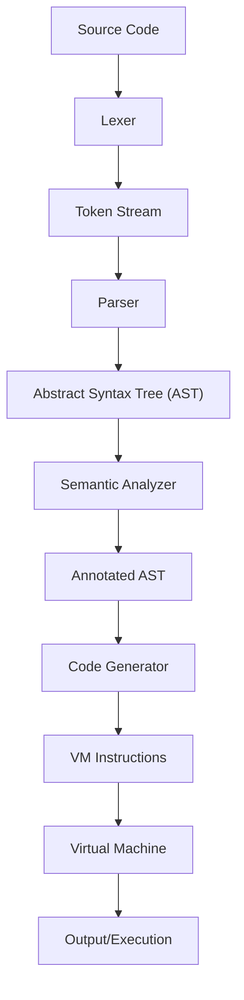

# rust_compiler_experiments/basic
## Basic Rust Toy compiler



### Key Components :notebook:

- Source Code: The inout program text
- Lexer: Breaks source into tokens (lexical analysis)
- Token Stream: Sequence of tokens for the parser
- Parser: Builds Abstract Syntax Tree (syntax analysis)
- AST: Heirarchical representation of the program.
- Semantic Analyzer: Checks for semantic errors (type checking, variable scope)
- Annotated AST: AST with semantic information
- Code Generator: Produces VM instructions.
- VM Instructions: Target code for the virtual machine.
- Virtual Machine: Executes the generated instructions.
- Output/Execution: Final program output.

This above shows the linear flow of data through the compiler phases, with each phase transforming the input into a more processed form until it becomes executable code.

### How to Use this Compiler

> Input Language: The compile accepts a simple language with:

- Variable decclarations (`let x = 10;`)
- Arithmetic expressions (`x + y * 2`)
- Print statements (`print(x + y);`)
- Basic arithmetic operations (`+`, `-`, `*`, `/`)

> Compilation Pipeline:

- Lexing: Breaks input into tokens
- Parsing: Builds an Abstract Syntax Tree (AST)
- Semantic Analysis: Checks for undefined varibles
- Code Generation: Produces instructions for a simple VM.
- VM Execution: Runs the generated instructions.

```rust
let x = 10;
let y = 20;
print(x + y);

```

The above code will output `30`

### Key Features :pushpin:

- Modular Design: Each compiler pse is separated into its own module
- Error Handling: Basic error reporting for syntax and semantic errors
- Extensible: Easy to add new language features.
- Tested: Includes unit tests for core components.

__Limitations__

- No type system (all values are integers)
- No control flow (if statements, loops)
- No functions
- Simple stack-based VM

To run this compiler, save it to a file (eg. to_compiler.rs) and compiler with:

```bash
rustc toy_compiler.rs
./toy_compiler

```
